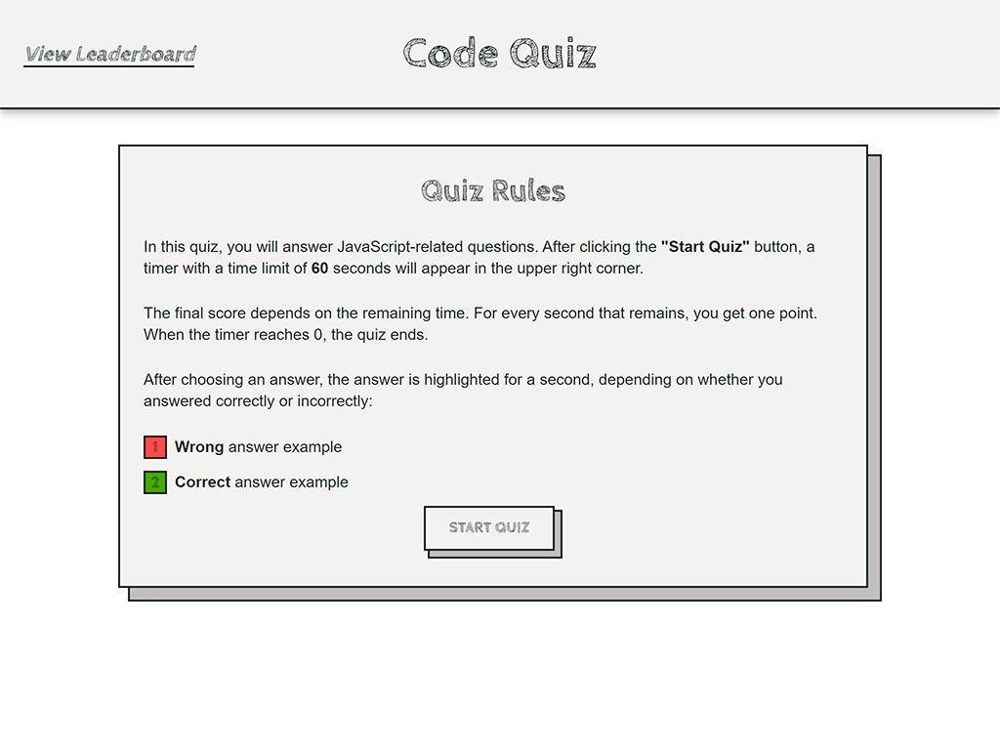
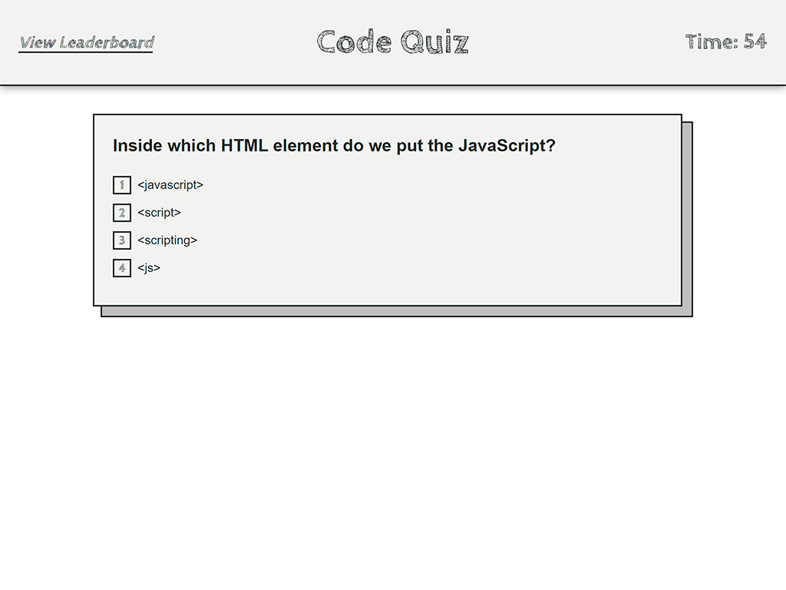
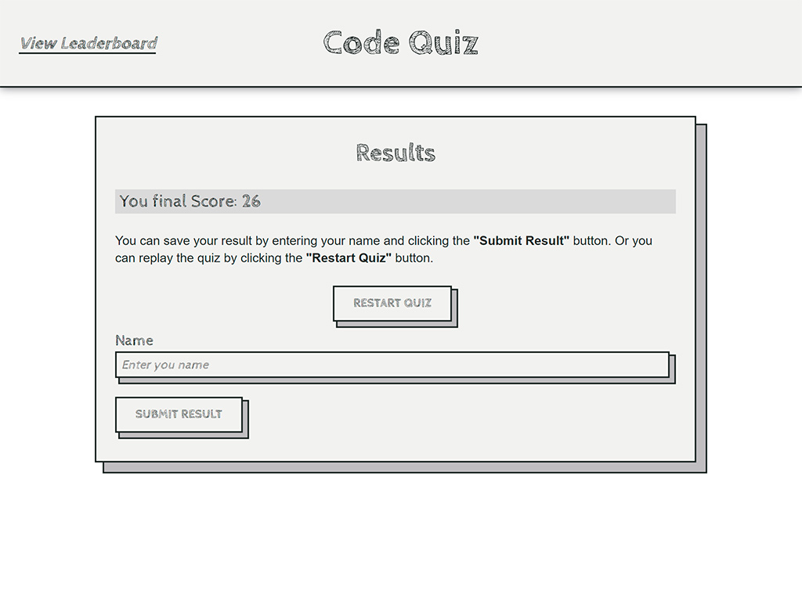
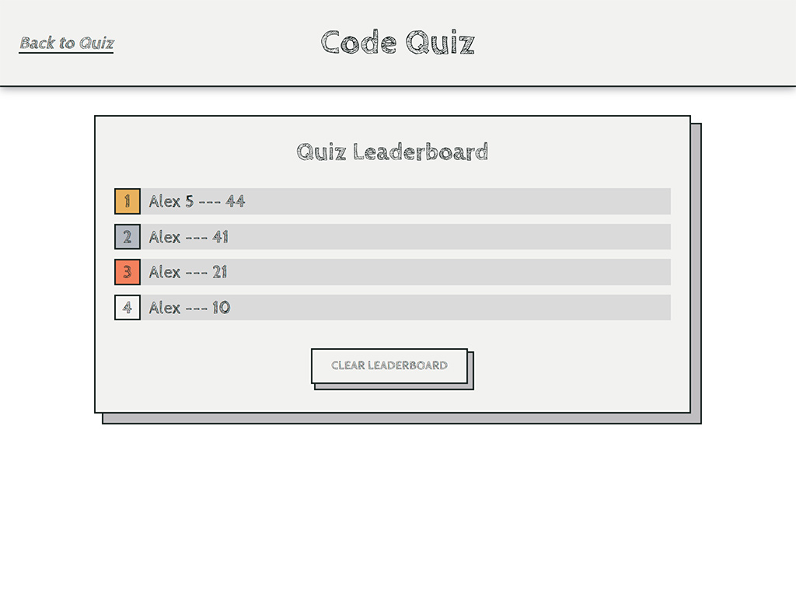

# Code Quiz

**Author: _Oleksandr Kulyk_**

**Preview link** - https://alexkuwerz.github.io/unh-code-quiz/src/index

## Description

In this quiz, you will answer JavaScript-related questions with limited timer. The final score depends on the remaining time. For every second that remains, you get one point. For each wrong answer, the timer will decrease by a certain number of seconds. After passing the quiz, you can save the result under your name and see all the results on the leaderboard page.

## Technologies

HTML, CSS, JavaScript.

## Preview Images

* **Start Page View**

* **Quiz Section View**

* **Result Section View**

* **Leaderboard Page View**

